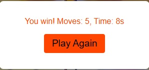
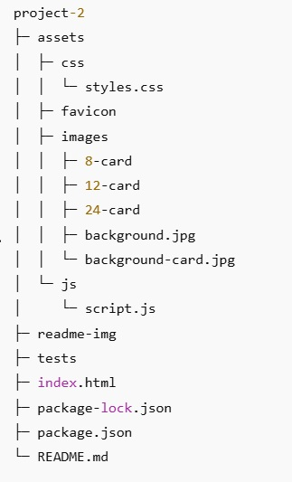
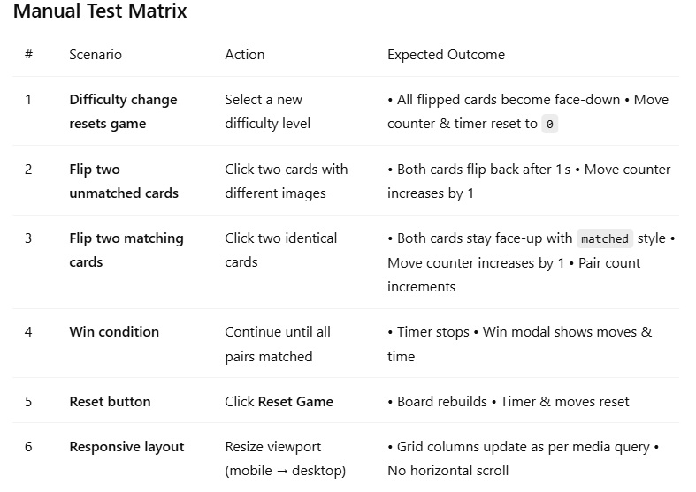
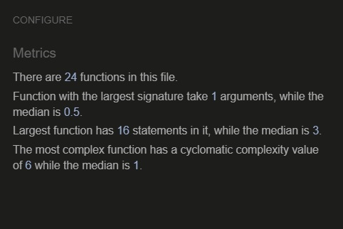
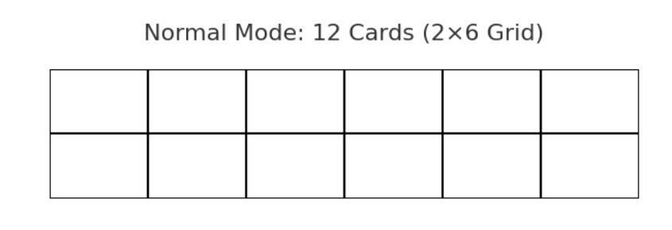
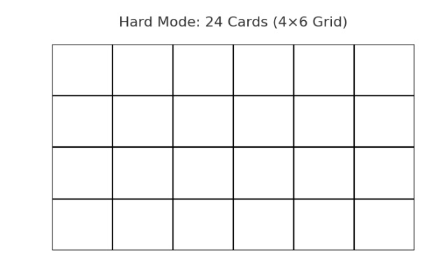
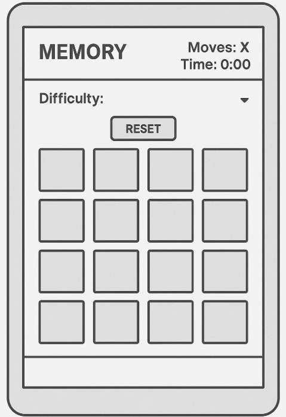

# Memory Game

Memory Game is a responsive card matching game built using HTML, CSS, and JavaScript. The game supports three difficulty modes, tracks moves and time, and uses a custom modal for win notifications instead of browser alerts. The project is designed to work on both mobile and desktop devices with a responsive layout.

✅ Site live at: https://god-zil-la.github.io/project-2/


## Table of Contents

- [Overview](#overview)
- [Visual Design & Assets](#colors)
- [Features](#features)
- [Folder Structure](#folder-structure)
- [Installation and Setup](#installation-and-setup)
- [Usage](#usage)
- [Functionality, Testing & Debugging](#functionality-testing--debugging)
- [Deployment](#Deployment)
- [Validation and Lighthouse](#validation)
- [Known Issues & Solutions](#known-issues--solutions)
- [Responsive Design](#responsive-design)
- [Future Enhancements](#future-enhancements)
- [Acknowledgements](#acknowledgements)
- [Credits](#credits)

## Overview
- Memory Game challenges players to flip cards and find matching pairs. Cards are generated dynamically based on the selected difficulty:


- **Easy:** 8 cards (4 pairs)


- **Normal:** 12 cards (6 pairs)


- **Hard:** 24 cards (12 pairs)


- When all pairs are matched, a modal displays your moves and time.



## Visual Design & Assets
### Colors
**Primary Accent: `orangered`**
- Used for interactive elements (e.g., Reset button, modal buttons), card borders, and text highlights.

**Header & Footer Background: `lightgray`**
- The header and footer have a light-gray background, providing contrast against the accent color.

**Card Borders:**  
- Default card border: `2px solid #333` (dark gray)  
- Card back border: `2px solid #2b2f77` (a darker, bluish shade)

**Hover States:**
- Buttons darken to #e1ab25 on hover.

**Text Colors:**
- By default, text is `orangered` on lighter backgrounds (header, footer). On the main game area, text inherits the body color or uses `orangered` for readability.

## Backgrounds
**Page Background**  
- **File Path:** `assets/images/background.jpg`  
- **Usage:** The entire game page uses a full-screen background image.  
- **CSS Snippet:**
```css
 { margin:0; padding:0; box-sizing:border-box; }
html, body { overflow-x:hidden; width:100%; height:100%; font-family:sans-serif; }
body {
  background: url('../images/background.jpg') center/cover no-repeat;
  color: orangered;
}
.visually-hidden { position:absolute; clip:rect(0 0 0 0); }
```
- You can replace this file with any image you want, maintaining the same file name or updating the path in `styles.css`.

**Card Front Background**  
- **File Path:** `assets/images/background-card.jpg`  
- **Usage:** The “front” of each card (the side you see before flipping) has a subtle background pattern.  
- **CSS Snippet:**
```css
.card-front {
  background: url('../images/background-card.jpg') center/cover no-repeat;
}
```
- You can also replace this to create a unique style for your card front.

### Card Images
**Back Images (Emojis or Themed Art):**  
- You have separate images for each difficulty stored in subfolders:
- `assets/images/8-card/`
- `assets/images/12-card/`
- `assets/images/24-card/`
- Each folder contains multiple PNGs (e.g., `emoji-1.png`, `emoji-2.png`) that represent the “back” face of a card (the image you reveal when you flip the card).

## Features
**Multiple Difficulty Modes:**
- Easy (8 cards)
- Normal (12 cards)
- Hard (24 cards)

**Responsive Design:**
- Mobile-first design with a fluid grid layout
- Fully responsive from very small devices (~200px wide) up to 4K desktops
- Horizontal scrolling disabled on small devices

**Game Mechanics:**
- Card flipping and matching logic
- Moves counter and timer
- Reset game functionality

**Custom Win Modal:**
- Consistent styling across browsers

## Buttons & Scrolling
**Buttons:**
- The game features interactive buttons for Reset and difficulty selection. Each button is styled with an accent color (orangered) and includes hover effects.

**Scrolling:**
- Horizontal scrolling is disabled to ensure a clean mobile experience (overflow-x: hidden; on html, body). Vertical scrolling is available for smaller screens if content exceeds the viewport height.

## Folder Structure



## Installation and Setup

**Clone or Download the Repository:**  
# clone repository
$ git clone https://github.com/God-zil-la/project-2.git
$ cd project-2

# (optional) serve locally with a lightweight server
$ npx live-server    # or python -m http.server

- Ensure the entire project folder is on your local machine.
- Verify Paths: Confirm image/CSS paths match the structure.
- Launch: Open index.html in your browser.


- **Note:** Secure these rules before deploying to production.

**Verify File Paths:**  
- Ensure that all image and CSS file paths match the folder structure described above. For example, from `assets/css/styles.css`, images are referenced with `../images/background.jpg`.

**Open the Game:**
- Open index.html in your web browser (Chrome, Firefox, etc.). Clear your cache or do a hard refresh if needed.

## Usage
**Start the Game:**
- Launch the game by opening index.html. The game is fully responsive from very small phones (around 200px wide) up to 4K desktops.

**Select Difficulty:**
- Choose a difficulty mode (Easy, Normal, Hard) using the dropdown in the header.

**Play the Game:**
- Flip cards to match pairs. The moves counter and timer track your progress. Click "Reset Game" to start a new game.

**Win:**
- When all pairs are matched, an alert displays your moves and time.

**Footer:**
- A full-width footer displays "Developed By Mr.Husse" with a texture background.

## Functionality, Testing & Debugging

**Card Generation & Matching:**
- Cards are generated based on the selected difficulty by duplicating and shuffling image arrays.
- Matching logic ensures that once a matching pair is found, the cards remain face-up.

**Timer & Moves Counter:**
- The timer starts at the beginning of each game and updates every second. 
- The moves counter increments as you flip cards. 
- Both reset on game restart.

**Responsive Design Testing:**
- The design is tested using browser Developer Tools to emulate devices from around 200px width up to 4K desktops.
- Media queries adjust font sizes, grid layouts, and card sizes, and horizontal scrolling is disabled by setting overflow-x: hidden; on html, body.

**Testing**
- The project combines automated unit tests (Jest) with a concise set of manual functional tests.
- Automated Tests
- Location: tests/ folder
- Runner: Jest
**How to run:**
- install dev‑dependencies
- npm install
- execute all Jest suites
- npm test

**Covered logic:**
- shuffleArray randomness & immutability
- generateCards returns correct duplicates & length per difficulty
- Card‑matching detection (checkForMatch helper extracted in tests)

**Manual Testing**




**Debug Logging:**
- Console logs (e.g., "Generated card values:" and "Display high score data:") help verify that functions execute correctly.
- Use Developer Tools (F12) to check the console for errors or debugging information.

## Deployment
The site is deployed using GitHub Pages directly from the repository’s main branch.
**Steps:**
- Enable GitHub Pages:
- Go to your repository on GitHub (https://github.com/God-zil-la/project-2).
- Navigate to Settings → Pages.
- Under Source, select Branch: main and Folder: /root.
- Click Save.
- Set Custom Domain (Optional):
- If desired, add a custom domain by creating a CNAME file or configure DNS settings in your domain provider's dashboard.

**Automatic Updates:**
- Every time you push code to the main branch, GitHub Pages automatically rebuilds and redeploys your website. Changes typically go live within approximately 30 seconds.
- Local Testing Before Deployment:
- Always test locally using tools like live-server or Python’s built-in HTTP server before pushing your changes:
- npx live-server
- python -m http.server

##Recommended Workflow:
- Make your changes locally.
- Run your automated tests (npm test).
- Perform the manual tests above.
- Push your verified changes to GitHub (main branch).

## Validation
**HTML**


- There were no errors found on any page using the W3C HTML Validator.

**CSS**


- There were no errors found in the stylesheet using the W3C CSS Validator.

**JS**



- There were no errors found in the javascript using the JS Hint Validator.

**Lighthouse Scores**
- Performance: 100
- Accessibility: 91
- Best Practices: 100
- SEO: 90


## Known Issues & Solutions
**Image Loading Errors (404):**
- Issue: Incorrect relative paths prevent images from loading.
- Solution: Adjust CSS paths (e.g., use ../images/background.jpg in assets/css/styles.css).

**Horizontal Scrolling:**
- Issue: Overflowing elements cause sideways scrolling on small devices.
- Solution: Apply overflow-x: hidden; on html, body to prevent horizontal scrolling.

## Responsive Design
**Mobile (<768px):**
- A fluid grid layout adapts to very small screens (around 200px wide) with adjusted font sizes and card heights.
- Horizontal scrolling is disabled.

**Tablet (≥768px):**
-  Slightly larger cards.

**Desktop (≥1200px):**
- For screens 1200px and wider, a fixed grid layout is applied based on the selected difficulty (using classes such as easy-desktop, normal-desktop, hard-desktop, and expert-desktop), with media queries scaling the layout up to 4K.
- Fixed grids—Easy: 4 cols, Normal/Hard: 6 cols.

**Testing:**


- Use Developer Tools to emulate various devices and verify that the layout scales correctly and no horizontal overflow occurs.

## Future Enhancements
**Leaderboard Expansion:**
- Extend the high score system to store multiple records per difficulty and display a full leaderboard.

**Enhanced Animations and Sound Effects:**
- Improve card flip animations and add sound effects.

**Accessibility Improvements:**
- Implement ARIA attributes and keyboard navigation.

**Custom Game Settings:**
- Allow users to choose a custom number of cards or additional game parameters.

## Acknowledgements
**Image Sources:**
- Images are sourced from Freepik, Redbubble, and Shutterstock.

**Responsive Design Resources:**
- Special thanks to online tutorials and community resources for guidance on responsive web design and JavaScript game development.

**Wireframe Design:**
- Wireframe sketches were created using Balsamiq.










## Credits

**Concept & Development**  
- Mr. Husse  
- Implemented the core game logic, card-matching mechanics, and overall structure.

**UI & Visual Design**  
- Utilized free or licensed images from Freepik, Redbubble, and Shutterstock.  
- All layout and styling adaptations done by Mr. Husse.

**Testing & Feedback**  
- Friends, family, and community members  
- Provided invaluable beta testing, bug reports, and gameplay suggestions.

**Community Contributions**  
- Open-source resources, tutorials, and forums  
- Offered insights on responsive design, JavaScript optimizations, and best practices.

**General Support**  
- A big thank you to friends, family, Code Institute, Slack and the broader dev community who play-tested and gave ongoing feedback.
- Thank you to my mentor Brian Macharia for his ongoing help and feedback. He has provided me with lots of tips and resources to help improve my coding and testing. Thanks also to my tutor Kasia Bogucka for facilitating stand-ups and workshops which are always very useful for catching up with everyone and getting some really useful advice and support.
- Big thank to https://www.w3schools.com/ for all help with coding this project