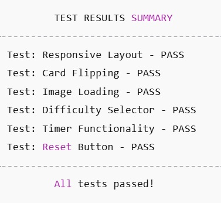
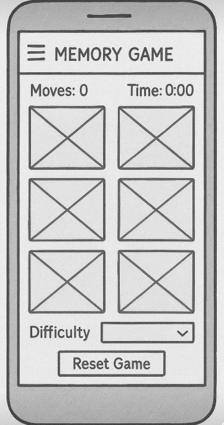
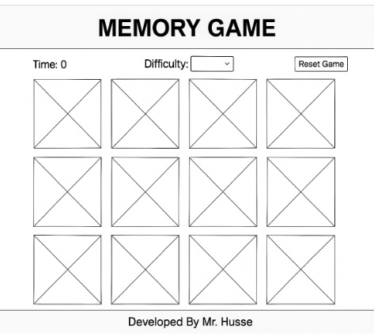

# Memory Game

Memory Game is a responsive card matching game built using HTML, CSS, and JavaScript. The game supports multiple difficulty modes, tracks moves and time, and saves a global best score (with the player's name) using Firebase Realtime Database. The project is designed to work on both mobile and desktop devices with a responsive layout.

✅ Site live at: https://god-zil-la.github.io/project-2/


## Table of Contents

- [Overview](#overview)
- [Visual Design & Assets](#colors)
- [Features](#features)
- [Folder Structure](#folder-structure)
- [Installation and Setup](#installation-and-setup)
- [Usage](#usage)
- [Functionality, Testing & Debugging](#functionality-testing--debugging)
- [Validation and Lighthouse](#validation)
- [Known Issues & Solutions](#known-issues--solutions)
- [Responsive Design](#responsive-design)
- [Future Enhancements](#future-enhancements)
- [Acknowledgements](#acknowledgements)
- [Credits](#credits)

## Overview
- Memory Game challenges players to flip cards and find matching pairs. Cards are generated dynamically based on the selected difficulty:


- **Easy:** 8 cards (4 pairs)


- **Normal:** 12 cards (6 pairs)


- **Hard:** 24 cards (12 pairs)


- When all pairs are matched, the game displays your moves and time. If your time is better than the stored record for that mode, an input field appears for you to enter your full name (finalized when you press Enter). The high score is then stored in Firebase Realtime Database and updates live across devices.


## Visual Design & Assets
### Colors
**Primary Accent: `orangered`**
- Used for interactive elements (e.g., the “Reset” button, header/footer text), card borders, and text highlights.

**Header & Footer Background: `lightgray`**
- The header and footer have a light-gray background, providing contrast against the accent color.

**Card Borders:**  
- Default card border: `2px solid #333` (dark gray)  
- Card back border: `2px solid #2b2f77` (a darker, bluish shade)

**Hover States:**
- Some interactive elements (like the reset button) may change to `#e1ab25` on hover, adding a noticeable highlight effect.

**Text Colors:**
- By default, text is `orangered` on lighter backgrounds (header, footer). On the main game area, text inherits the body color or uses `orangered` for readability.

## Backgrounds
**Page Background**  
- **File Path:** `assets/images/background.jpg`  
- **Usage:** The entire game page uses a full-screen background image.  
- **CSS Snippet:**
```css
body {
background-image: url('../images/background.jpg');
background-size: cover;
background-position: center;
background-repeat: no-repeat;
}
```
- You can replace this file with any image you want, maintaining the same file name or updating the path in `styles.css`.

**Card Front Background**  
- **File Path:** `assets/images/background-card.jpg`  
- **Usage:** The “front” of each card (the side you see before flipping) has a subtle background pattern.  
- **CSS Snippet:**
```css
.card-front {
background-image: url('../images/background-card.jpg');
background-size: cover;
background-position: center;
background-repeat: no-repeat;
}
```
- You can also replace this to create a unique style for your card front.

### Card Images
**Back Images (Emojis or Themed Art):**  
- You have separate images for each difficulty stored in subfolders:
- `assets/images/8-card/`
- `assets/images/12-card/`
- `assets/images/24-card/`
- Each folder contains multiple PNGs (e.g., `emoji-1.png`, `emoji-2.png`) that represent the “back” face of a card (the image you reveal when you flip the card).

## Features
**Multiple Difficulty Modes:**
- Easy (8 cards)
- Normal (12 cards)
- Hard (24 cards)

**Responsive Design:**
- Mobile-first design with a fluid grid layout
- Fully responsive from very small devices (~200px wide) up to 4K desktops
- Horizontal scrolling disabled on small devices

**Game Mechanics:**
- Card flipping and matching logic
- Moves counter and timer
- Reset game functionality

**High Score System:**
- Global high scores stored in Firebase Realtime Database
- Input field for entering the full name when a new record is achieved (finalized on Enter)
- Live updates across devices

**Firebase Integration:**
- Uses Firebase Realtime Database (RTDB) via the compat SDK
- Configured for the Europe-west1 region

## Buttons & Scrolling
**Buttons:**
- The game features interactive buttons for Reset and difficulty selection. Each button is styled with an accent color (orangered) and includes hover effects.

**Scrolling:**
- Horizontal scrolling is disabled to ensure a clean mobile experience (overflow-x: hidden; on html, body). Vertical scrolling is available for smaller screens if content exceeds the viewport height.

## Folder Structure


## Installation and Setup

**Clone or Download the Repository:**  
- Ensure the entire project folder is on your local machine.

**Firebase Setup:**  
- Create a Firebase project and enable Realtime Database.
- Update the Firebase configuration in `js/script.js` with your project's credentials.
- For testing, set your RTDB rules to allow public read/write:
```json
{
"rules": {
".read": true,
".write": true
}
}
```
- **Note:** Secure these rules before deploying to production.

**Verify File Paths:**  
- Ensure that all image and CSS file paths match the folder structure described above. For example, from `assets/styles.css/styles.css`, images are referenced with `../images/background.jpg`.

**Include Firebase SDK Scripts:**  
- In your `index.html`'s `<head>`, include the Firebase compat SDK scripts only once:
html
- <script src="https://www.gstatic.com/firebasejs/9.17.1/firebase-app-compat.js"></script>
- <script src="https://www.gstatic.com/firebasejs/9.17.1/firebase-database-compat.js"></script>

**Open the Game:**
- Open index.html in your web browser (Chrome, Firefox, etc.). Clear your cache or do a hard refresh if needed.

## Usage
**Start the Game:**
- Launch the game by opening index.html. The game is fully responsive from very small phones (around 200px wide) up to 4K desktops.

**Select Difficulty:**
- Choose a difficulty mode (Easy, Normal, Hard, Expert) using the dropdown in the header.

**Play the Game:**
- Flip cards to match pairs. The moves counter and timer track your progress. Click "Reset Game" to start a new game.

**Winning & High Score:**
- When all pairs are matched, an alert displays your moves and time.
- If your time is lower than the stored best record for that difficulty, an input field appears for you to enter your full name.
- Type your full name and press Enter to finalize the high score. The record is saved in Firebase RTDB and updates live across devices.

**Footer:**
- A full-width footer displays "Developed By Mr.Husse" with a texture background.

## Functionality, Testing & Debugging

**Card Generation & Matching:**
- Cards are generated based on the selected difficulty by duplicating and shuffling image arrays.
- Matching logic ensures that once a matching pair is found, the cards remain face-up.

**Timer & Moves Counter:**
- The timer starts at the beginning of each game and updates every second. 
- The moves counter increments as you flip cards. 
- Both reset on game restart.

**High Score System:**
- High scores are stored in Firebase RTDB. When you win and set a new record, an input field appears for you to enter your full name.
- The record is finalized only when you press Enter.
- A realtime listener updates the displayed high score so that changes are reflected across devices.

**Responsive Design Testing:**
- The design is tested using browser Developer Tools to emulate devices from around 200px width up to 4K desktops.
- Media queries adjust font sizes, grid layouts, and card sizes, and horizontal scrolling is disabled by setting overflow-x: hidden; on html, body.

**Debug Logging:**
- Console logs (e.g., "Generated card values:" and "Display high score data:") help verify that functions execute correctly.
- Use Developer Tools (F12) to check the console for errors or debugging information.

## Validation
**HTML**


- There were no errors found on any page using the W3C HTML Validator.

**CSS**


- There were no errors found in the stylesheet using the W3C CSS Validator.

**JS**


- There were no errors found in the javascript using the JS Hint Validator.

**Lighthouse Scores**
- Performance: 97
- Accessibility: 91
- Best Practices: 100
- SEO: 90


## Known Issues & Solutions
**Firebase SDK Duplication:**
- Issue: Loading Firebase SDK scripts multiple times causes conflicts.
- Solution: Ensure Firebase SDKs are included only once in index.html.

**Database Region Warning:**
- Issue: Incorrect databaseURL causing warnings.
- Solution: Update the Firebase configuration with the correct databaseURL (e.g., https://memory-b0d16-default-rtdb.europe-west1.firebasedatabase.app).

**Image Loading Errors (404):**
- Issue: Incorrect relative paths prevent images from loading.
- Solution: Adjust CSS paths (e.g., use ../images/background.jpg in assets/styles.css/styles.css).

**Horizontal Scrolling:**
- Issue: Overflowing elements cause sideways scrolling on small devices.
- Solution: Apply overflow-x: hidden; on html, body to prevent horizontal scrolling.

**High Score Input Closes Prematurely:**
- Issue: The input field for entering the high score name was closing after one letter.
- Solution: Changed the event listener to a keydown event that waits for the Enter key to finalize the name entry.

**Expert Mode Integration:**
- Issue: Adding Expert mode (40 cards) required extra image arrays and code adjustments.
- Solution: Added an expertImages array and updated the generateCards() function and desktop layout adjustments accordingly.

## Responsive Design
**Mobile:**
- A fluid grid layout adapts to very small screens (around 200px wide) with adjusted font sizes and card heights.
- Horizontal scrolling is disabled.

**Desktop:**
- For screens 1200px and wider, a fixed grid layout is applied based on the selected difficulty (using classes such as easy-desktop, normal-desktop, hard-desktop, and expert-desktop), with media queries scaling the layout up to 4K.

**Testing:**



- Use Developer Tools to emulate various devices and verify that the layout scales correctly and no horizontal overflow occurs.

## Future Enhancements
**Leaderboard Expansion:**
- Extend the high score system to store multiple records per difficulty and display a full leaderboard.

**Enhanced Animations and Sound Effects:**
- Improve card flip animations and add sound effects.

**Accessibility Improvements:**
- Implement ARIA attributes and keyboard navigation.

**Custom Game Settings:**
- Allow users to choose a custom number of cards or additional game parameters.

**Improved Security:**
- Update Firebase RTDB rules for production to secure data access.

## Acknowledgements
**Firebase:**
- Memory Game uses Firebase Realtime Database for storing high scores and enabling live updates.

**Image Sources:**
- Images are sourced from Freepik, Redbubble, and Shutterstock.

**Responsive Design Resources:**
- Special thanks to online tutorials and community resources for guidance on responsive web design and JavaScript game development.

**Wireframe Design:**
- Wireframe sketches were created using Balsamiq.





**General Support**  
- A big thank you to friends, family, Code Institute, Slack and the broader dev community who play-tested and gave ongoing feedback.

## Credits

**Concept & Development**  
- Mr. Husse  
- Implemented the core game logic, card-matching mechanics, and overall structure.

**UI & Visual Design**  
- Utilized free or licensed images from Freepik, Redbubble, and Shutterstock.  
- All layout and styling adaptations done by Mr. Husse.

**Firebase Integration**  
- Firebase Realtime Database  
- Used for storing and syncing high scores across devices.

**Testing & Feedback**  
- Friends, family, and community members  
- Provided invaluable beta testing, bug reports, and gameplay suggestions.

**Community Contributions**  
- Open-source resources, tutorials, and forums  
- Offered insights on responsive design, JavaScript optimizations, and best practices.

